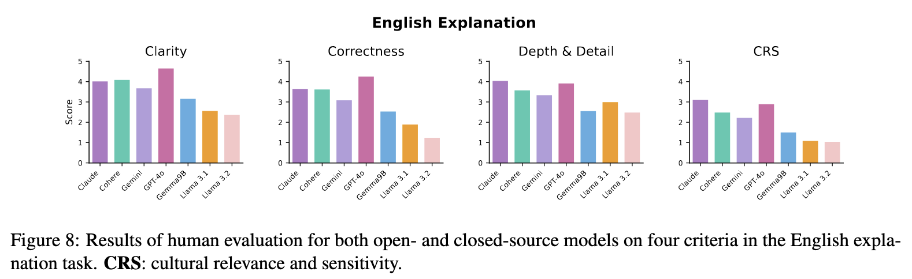

<div align="center">

<h2 class="papername">
  
  Jawaher: A Multidialectal Dataset of Arabic Proverbs for LLM Benchmarking
</h2>

  <div>
    <div>
      <a href="https://your-institution.edu/team" target="_blank">Samar M. Magdy</a>,
      <a href="https://skwon01-ubc.github.io/website/" target="_blank">Sang Yun Kwon</a>,
      <a href="https://your-institution.edu/team" target="_blank">Fakhraddin Alwajih</a>,
      <a href="https://your-institution.edu/team" target="_blank">Safaa Abdelfadil</a>,
      <a href="https://your-institution.edu/team" target="_blank">Shady Shehata</a>,
      <a href="https://mageed.arts.ubc.ca/" target="_blank">Muhammad Abdul-Mageed</a>
    </div>
    The University of British Columbia, MBZUAI, Invertible AI<br>
  </div>
</div>

<p align="center">
  <a href='https://arxiv.org/abs/2503.00231'></a>
  <a href='https://huggingface.co/datasets/UBC-NLP/Jawaher-benchmark'></a>
  <a href='https://arxiv.org/abs/2503.00231'></a>
</p>

</div>

## Updates 🚨
- **[03/01/2025]** We've released the Jawaher dataset on [Huggigface](https://huggingface.co/datasets/UBC-NLP/Jawaher-benchmark)
- **[01/22/2025]** [Jawaher](https://arxiv.org/abs/2503.00231) has been accepted at [NAACL 2025].
- **[03/03/2025]** [ArXiv paper](https://arxiv.org/abs/2503.00231) released.

## Abstract
Recent advancements in instruction fine-tuning, alignment methods such as reinforcement learning from human feedback (RLHF), and optimization techniques like direct preference optimization (DPO), have significantly enhanced the adaptability of large language models (LLMs) to user preferences. However, despite these innovations, many LLMs continue to exhibit biases toward Western, Anglo-centric, or American cultures, with performance on English data consistently surpassing that of other languages. This reveals a persistent cultural gap in LLMs, which complicates their ability to accurately process culturally rich and diverse figurative language, such as proverbs. To address this, we introduce Jawaher, a benchmark designed to assess LLMs' capacity to comprehend and interpret Arabic proverbs. Jawaher includes proverbs from various Arabic dialects, along with idiomatic translations and explanations. Through extensive evaluations of both open- and closed-source models, we find that while LLMs can generate idiomatically accurate translations, they struggle with producing culturally nuanced and contextually relevant explanations. These findings highlight the need for ongoing model refinement and dataset expansion to bridge the cultural gap in figurative language processing.

## Jawaher Benchmark
Jawaher consists of Arabic proverbs paired with their idiomatic or literal English translations, along with explanations in both Arabic and English, covering 20 different Arabic varieties. Below are some examples from the Jawaher benchmark, specifically from Algeria, Bahrain, Egypt, Iraq, and Jordan.


## Evaluation on Jawaher
We evaluate Jawaher using both open- and closed-source state-of-the-art multilingual LLMs (mLLMs) to assess their abilities across our proposed tasks. The models are tested in a zero-shot setting.





## Citation

If you find this work useful for your research, please kindly cite our paper:
```bibtex
@inproceedings{yourname2024jawaher,
    title = "Jawaher: A Multidialectal Dataset of Arabic Proverbs for LLM Benchmarking",
    author = "Your Name and Collaborators",
    booktitle = "Proceedings of the [Conference Name]",
    year = "2024",
    address = "[Conference Location]",
    publisher = "[Publisher]",
    url = "[Paper URL]",
    doi = "[DOI]",
    pages = "[Pages]"
}
